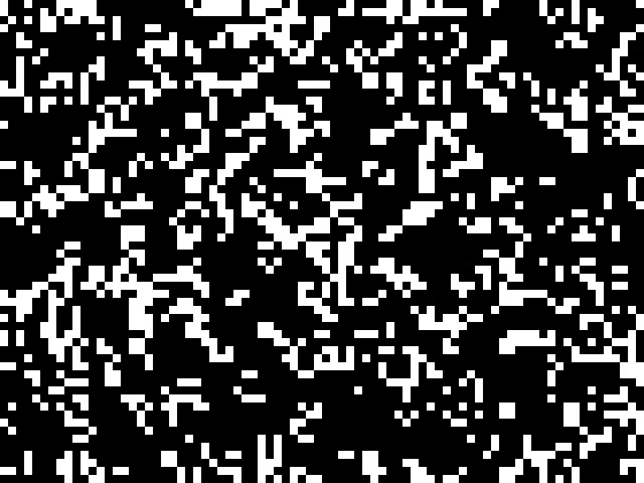
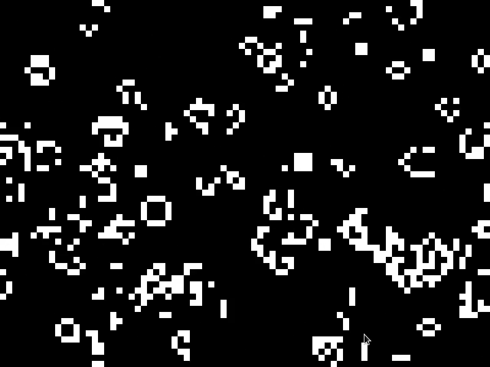

# Automata

A simple implementation of [Conway's Game of Life](https://en.wikipedia.org/wiki/Conway%27s_Game_of_Life) using C and [raylib](https://www.raylib.com/).



## Quick start

You need `raylib` and `libc` as dependencies. To compile, just run:

```console
./build.sh
```

To run the application, simply run:

```console
./gol
```

## Usage

You can do the following:

* **Space**: pause simulation
* **Left Mouse Button**: make living cell
* **Right Mouse Button**: make dead cell
* **Enter**: step-by-step simulation


